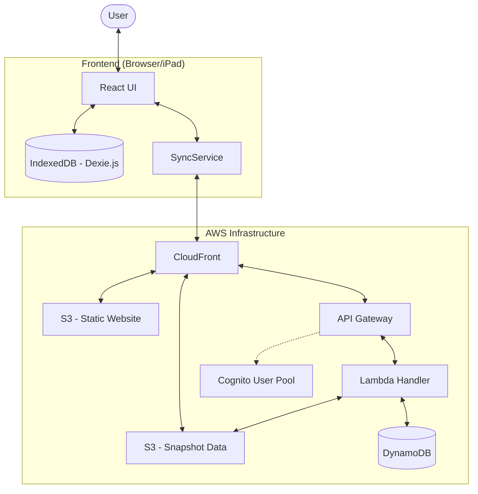
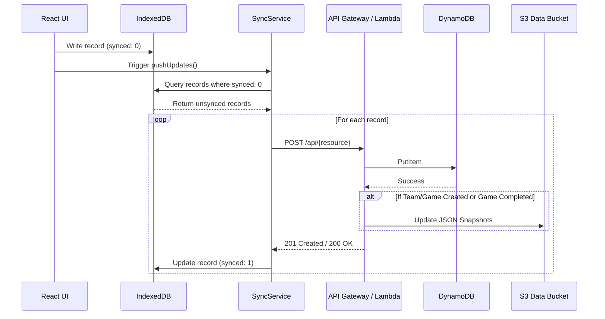
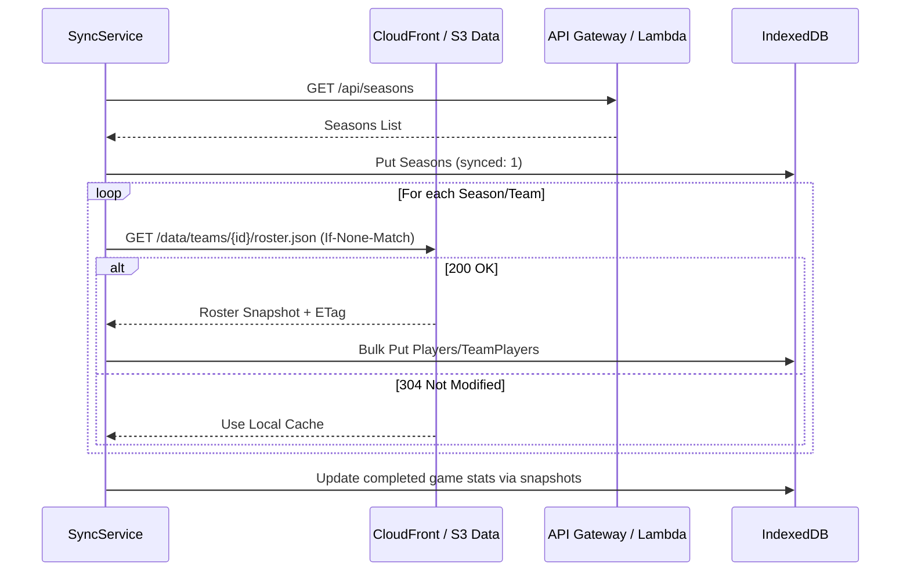

# Data Flow and System Architecture

This document describes the high-level architecture and detailed data flow for the Basketball Stats application.

## High-Level Architecture

The application is built using a serverless architecture on AWS, with a local-first frontend for offline capabilities.

## Detailed Data Flow

### Offline-First Synchronization

The application uses a "push-then-pull" strategy to synchronize local changes with the backend while ensuring data consistency.

#### 1. Push Updates (Local to Remote)

When a user performs an action (e.g., records a stat, creates a team), it is first saved to IndexedDB with `synced: 0`.

#### 2. Pull Updates (Remote to Local)

The `pullAll` and `syncTeamDetails` processes fetch the latest snapshots and API data to populate the local database.

### Snapshot Generation

Snapshots are pre-computed JSON files stored in S3 to facilitate fast, efficient data retrieval for the frontend, especially during initial sync or when viewing historical data.

- **Roster Snapshot:** Generated when a team is created or a player is added to a team.
- **Games Snapshot:** Generated when a game is created or completed.
- **Game Stats Snapshot:** Generated when a game is marked as completed. This includes calculated final scores and the W/L result.
