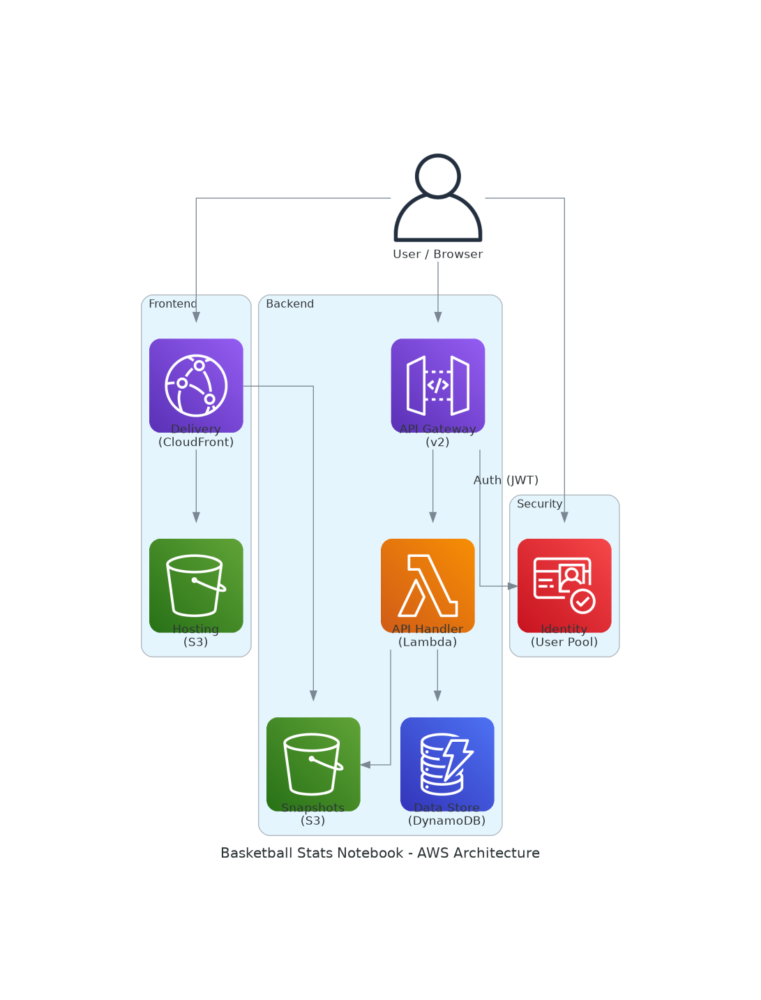

# Scorebook Infrastructure

This directory contains the Terraform configuration for the Scorebook serverless basketball stats application.

## Architecture



> The diagram above is auto-generated by GitHub Actions on every push to `main`.

## AWS Resources

The following AWS services are provisioned by this Terraform configuration:

| Service | Resource | Purpose |
|---|---|---|
| **Cognito** | User Pool + Client | Authentication & JWT issuance |
| **DynamoDB** | `BasketballStats` table | Primary data store (PK/SK + GSI1) |
| **S3** | `basketball-stats-frontend-*` | Static frontend hosting (private, OAC) |
| **CloudFront** | Distribution | CDN / HTTPS termination for frontend |
| **API Gateway v2** | HTTP API | REST endpoint with JWT Cognito authorizer |
| **Lambda** | `basketball-stats-api-handler` | Business logic, Node.js 20.x |
| **IAM** | Role + Policies | Least-privilege Lambda execution |

## Usage

```bash
cd infra
terraform init
terraform plan
terraform apply
```

---

<!-- BEGIN_TF_DOCS -->
@file main.tf
@description Main Terraform configuration for the Basketball Stats application.
Defines Cognito, DynamoDB, S3, API Gateway, Lambda, and CloudFront resources.

## Requirements

| Name | Version |
|------|---------|
| <a name="requirement_terraform"></a> [terraform](#requirement\_terraform) | >= 1.0.0 |
| <a name="requirement_aws"></a> [aws](#requirement\_aws) | ~> 6.0 |
| <a name="requirement_null"></a> [null](#requirement\_null) | ~> 3.0 |
| <a name="requirement_random"></a> [random](#requirement\_random) | ~> 3.0 |

## Providers

| Name | Version |
|------|---------|
| <a name="provider_aws"></a> [aws](#provider\_aws) | ~> 6.0 |
| <a name="provider_null"></a> [null](#provider\_null) | ~> 3.0 |
| <a name="provider_random"></a> [random](#provider\_random) | ~> 3.0 |

## Modules

No modules.

## Resources

| Name | Type |
|------|------|
| [aws_apigatewayv2_api.http_api](https://registry.terraform.io/providers/hashicorp/aws/latest/docs/resources/apigatewayv2_api) | resource |
| [aws_apigatewayv2_authorizer.cognito](https://registry.terraform.io/providers/hashicorp/aws/latest/docs/resources/apigatewayv2_authorizer) | resource |
| [aws_apigatewayv2_integration.lambda_integration](https://registry.terraform.io/providers/hashicorp/aws/latest/docs/resources/apigatewayv2_integration) | resource |
| [aws_apigatewayv2_route.proxy_route](https://registry.terraform.io/providers/hashicorp/aws/latest/docs/resources/apigatewayv2_route) | resource |
| [aws_apigatewayv2_stage.default](https://registry.terraform.io/providers/hashicorp/aws/latest/docs/resources/apigatewayv2_stage) | resource |
| [aws_cloudfront_distribution.distribution](https://registry.terraform.io/providers/hashicorp/aws/latest/docs/resources/cloudfront_distribution) | resource |
| [aws_cloudfront_function.auth_validator](https://registry.terraform.io/providers/hashicorp/aws/latest/docs/resources/cloudfront_function) | resource |
| [aws_cloudfront_origin_access_control.oac](https://registry.terraform.io/providers/hashicorp/aws/latest/docs/resources/cloudfront_origin_access_control) | resource |
| [aws_cognito_user_pool.pool](https://registry.terraform.io/providers/hashicorp/aws/latest/docs/resources/cognito_user_pool) | resource |
| [aws_cognito_user_pool_client.client](https://registry.terraform.io/providers/hashicorp/aws/latest/docs/resources/cognito_user_pool_client) | resource |
| [aws_dynamodb_table.table](https://registry.terraform.io/providers/hashicorp/aws/latest/docs/resources/dynamodb_table) | resource |
| [aws_iam_role.lambda_exec](https://registry.terraform.io/providers/hashicorp/aws/latest/docs/resources/iam_role) | resource |
| [aws_iam_role_policy.dynamodb_policy](https://registry.terraform.io/providers/hashicorp/aws/latest/docs/resources/iam_role_policy) | resource |
| [aws_iam_role_policy.s3_data_policy](https://registry.terraform.io/providers/hashicorp/aws/latest/docs/resources/iam_role_policy) | resource |
| [aws_iam_role_policy_attachment.lambda_policy](https://registry.terraform.io/providers/hashicorp/aws/latest/docs/resources/iam_role_policy_attachment) | resource |
| [aws_lambda_function.api_handler](https://registry.terraform.io/providers/hashicorp/aws/latest/docs/resources/lambda_function) | resource |
| [aws_lambda_permission.api_gw](https://registry.terraform.io/providers/hashicorp/aws/latest/docs/resources/lambda_permission) | resource |
| [aws_s3_bucket.data_bucket](https://registry.terraform.io/providers/hashicorp/aws/latest/docs/resources/s3_bucket) | resource |
| [aws_s3_bucket.hosting_bucket](https://registry.terraform.io/providers/hashicorp/aws/latest/docs/resources/s3_bucket) | resource |
| [aws_s3_bucket_lifecycle_configuration.data_bucket_lifecycle](https://registry.terraform.io/providers/hashicorp/aws/latest/docs/resources/s3_bucket_lifecycle_configuration) | resource |
| [aws_s3_bucket_policy.data_bucket_policy](https://registry.terraform.io/providers/hashicorp/aws/latest/docs/resources/s3_bucket_policy) | resource |
| [aws_s3_bucket_policy.hosting_bucket_policy](https://registry.terraform.io/providers/hashicorp/aws/latest/docs/resources/s3_bucket_policy) | resource |
| [aws_s3_bucket_public_access_block.data_bucket_block](https://registry.terraform.io/providers/hashicorp/aws/latest/docs/resources/s3_bucket_public_access_block) | resource |
| [aws_s3_bucket_public_access_block.hosting_bucket_block](https://registry.terraform.io/providers/hashicorp/aws/latest/docs/resources/s3_bucket_public_access_block) | resource |
| [aws_s3_bucket_server_side_encryption_configuration.data_bucket_encryption](https://registry.terraform.io/providers/hashicorp/aws/latest/docs/resources/s3_bucket_server_side_encryption_configuration) | resource |
| [aws_s3_bucket_server_side_encryption_configuration.hosting_bucket_encryption](https://registry.terraform.io/providers/hashicorp/aws/latest/docs/resources/s3_bucket_server_side_encryption_configuration) | resource |
| [aws_s3_bucket_versioning.data_bucket_versioning](https://registry.terraform.io/providers/hashicorp/aws/latest/docs/resources/s3_bucket_versioning) | resource |
| [null_resource.frontend_deploy](https://registry.terraform.io/providers/hashicorp/null/latest/docs/resources/resource) | resource |
| [random_id.id](https://registry.terraform.io/providers/hashicorp/random/latest/docs/resources/id) | resource |
| [aws_cloudfront_cache_policy.disabled](https://registry.terraform.io/providers/hashicorp/aws/latest/docs/data-sources/cloudfront_cache_policy) | data source |
| [aws_cloudfront_cache_policy.optimized](https://registry.terraform.io/providers/hashicorp/aws/latest/docs/data-sources/cloudfront_cache_policy) | data source |
| [aws_cloudfront_origin_request_policy.all_except_host](https://registry.terraform.io/providers/hashicorp/aws/latest/docs/data-sources/cloudfront_origin_request_policy) | data source |

## Inputs

| Name | Description | Type | Default | Required |
|------|-------------|------|---------|:--------:|
| <a name="input_aws_region"></a> [aws\_region](#input\_aws\_region) | The AWS region to deploy all resources into. | `string` | `"us-east-1"` | no |
| <a name="input_project_name"></a> [project\_name](#input\_project\_name) | The name of the project, used as a prefix for various resource names. | `string` | `"basketball-stats"` | no |

## Outputs

| Name | Description |
|------|-------------|
| <a name="output_api_endpoint"></a> [api\_endpoint](#output\_api\_endpoint) | The base URL for the HTTP API Gateway. |
| <a name="output_cloudfront_domain"></a> [cloudfront\_domain](#output\_cloudfront\_domain) | The domain name of the CloudFront distribution hosting the website. |
| <a name="output_cognito_client_id"></a> [cognito\_client\_id](#output\_cognito\_client\_id) | The ID of the Cognito User Pool Client for the frontend. |
| <a name="output_cognito_user_pool_id"></a> [cognito\_user\_pool\_id](#output\_cognito\_user\_pool\_id) | The ID of the Cognito User Pool for authentication. |
| <a name="output_data_bucket_id"></a> [data\_bucket\_id](#output\_data\_bucket\_id) | The name of the S3 bucket storing JSON snapshots. |
| <a name="output_dynamodb_table_name"></a> [dynamodb\_table\_name](#output\_dynamodb\_table\_name) | The name of the main DynamoDB table for all application data. |
| <a name="output_hosting_bucket_id"></a> [hosting\_bucket\_id](#output\_hosting\_bucket\_id) | The name of the S3 bucket hosting the frontend assets. |
<!-- END_TF_DOCS -->
